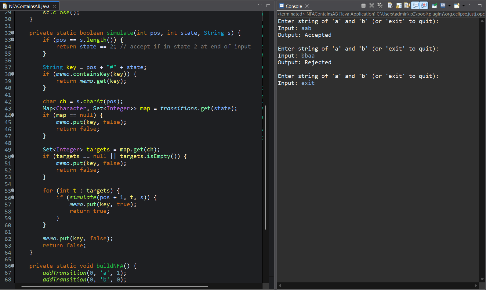

# NFA Simulation (Multiple Next States)

A Java program that simulates a **Non-deterministic Finite Automaton (NFA)** which accepts strings containing the substring **"ab"**.

---

## 🧠 Objective
Implement and simulate an NFA that accepts all strings containing `"ab"` as a substring.

---

## ⚙️ Features
- Represents the NFA as a map: `state -> (symbol -> set of next states)`.
- Uses recursion to explore multiple transition paths.
- Validates input to ensure it only contains `'a'` and `'b'`.
- Reports whether the string is **Accepted** or **Rejected**.

---

## 📋 NFA Design

| State | Input `'a'` | Input `'b'` | Description |
|--------|--------------|--------------|--------------|
| **q0** | {q1} | {q0} | Start state |
| **q1** | {q1} | {q2} | Saw `'a'`, waiting for `'b'` |
| **q2** | {q2} | {q2} | Accepting state (contains `'ab'`) |

- **Start State:** q0  
- **Accept State:** q2  
- **Language:** Strings containing `"ab"`

---

## 🧪 Program Output

---
